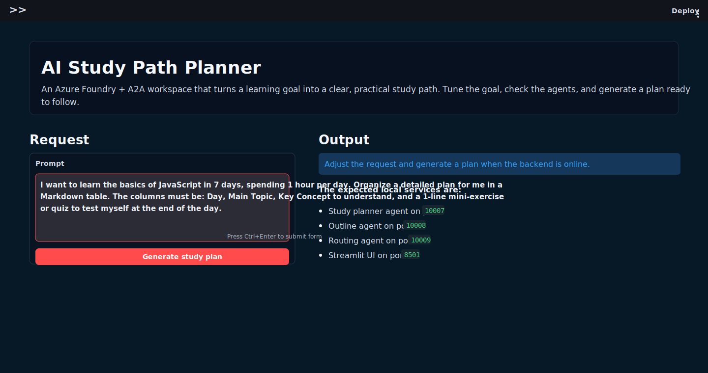
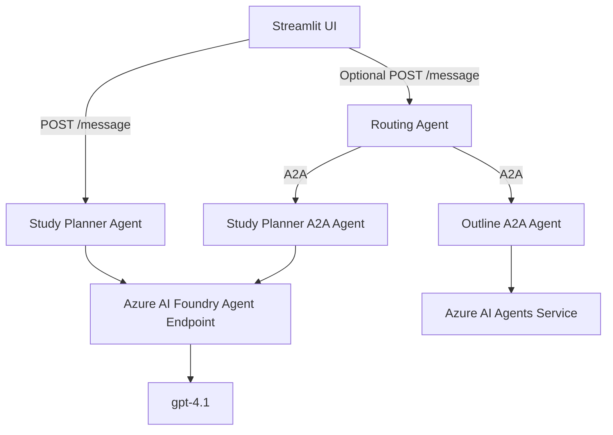

# AI Study Path Planner

An AI-powered study planning app built with **Azure AI Foundry**, **A2A agent communication**, **FastAPI/Starlette**, and **Streamlit**.

The app turns a learning goal into a structured study path with milestones, exercises, checkpoints, and a final mini project. It includes a local Streamlit interface, a direct Study Planner agent endpoint, and a routing agent that can communicate with remote A2A agents.

## Demo

GitHub can show the source code, screenshots, architecture, setup instructions, and sample outputs. The interactive Streamlit UI cannot run directly inside a normal GitHub repository because it needs a Python server, Azure authentication, and local backend agents.

To make the UI clickable from a GitHub README or LinkedIn post, deploy it to one of these:

- **Streamlit Community Cloud** for a simple public demo.
- **Azure App Service** or **Azure Container Apps** for a more professional Azure-hosted deployment.
- **GitHub README + screenshots** for a portfolio-friendly static presentation.

The repository includes a static preview of the UI so visitors can understand the experience directly from GitHub:



Sample generated outputs are available in [docs/demo-output.md](docs/demo-output.md).

## Features

- Generates structured study plans from a natural-language learning goal.
- Supports difficulty and duration customization from the UI.
- Adds weekly milestones, exercises, checkpoints, and self-assessment questions.
- Uses Azure AI Foundry with Azure Identity authentication.
- Exposes a direct `/message` endpoint for the Streamlit UI.
- Includes A2A-compatible title/study, outline, and routing agents.
- Provides health checks for each local backend service.

## Architecture



## Project Structure

```text
python/
|-- web_ui.py                  # Streamlit interface
|-- run_all.py                 # Starts the local backend services and UI
|-- client.py                  # CLI client for the routing agent
|-- title_agent/
|   |-- server.py              # Study Planner A2A server + direct /message endpoint
|   |-- agent_executor.py      # A2A task execution logic
|   |-- foundry_client.py      # Azure Foundry Responses API client
|   `-- agent.py               # Azure AI Agents implementation
|-- outline_agent/
|   |-- server.py              # Outline A2A server
|   |-- agent_executor.py      # Outline A2A execution logic
|   `-- agent.py               # Azure AI Agents implementation
|-- routing_agent/
|   |-- server.py              # FastAPI routing endpoint
|   `-- agent.py               # Routing agent and A2A client logic
|-- requirements.txt
`-- .env.example
```

## Setup

### Prerequisites

- Python 3.10+
- Azure subscription with Azure AI Foundry access
- Azure CLI authenticated with `az login`
- A deployed Azure AI Foundry agent/model

### Install

```powershell
cd Labfiles\09-build-remote-agents-with-a2a\python
python -m venv labenv
.\labenv\Scripts\Activate.ps1
pip install -r requirements.txt
```

Create a `.env` file from `.env.example` and update the Azure values:

```env
SERVER_URL=localhost
TITLE_AGENT_PORT=10007
OUTLINE_AGENT_PORT=10008
ROUTING_AGENT_PORT=10009

FOUNDRY_AGENT_ENDPOINT=https://your-resource.services.ai.azure.com/api/projects/your-project/agents/your-agent/endpoint/protocols/openai/responses
FOUNDRY_API_VERSION=v1
FOUNDRY_AGENT_MODEL=gpt-4.1
PROJECT_ENDPOINT=https://your-resource.services.ai.azure.com/api/projects/your-project
MODEL_DEPLOYMENT_NAME=gpt-4.1
```

## Run Locally

```powershell
cd Labfiles\09-build-remote-agents-with-a2a\python
.\labenv\Scripts\Activate.ps1
python run_all.py
```

Open the UI:

```text
http://localhost:8501
```

Expected local services:

- Study Planner agent: `http://localhost:10007`
- Outline agent: `http://localhost:10008`
- Routing agent: `http://localhost:10009`
- Streamlit UI: `http://localhost:8501`

## API Test

Health check:

```powershell
Invoke-WebRequest -UseBasicParsing http://localhost:10007/health
```

Generate a study plan:

```powershell
$body = @{
  message = "Create an intermediate study plan for Azure AI agents. Duration: 4 weeks."
} | ConvertTo-Json

Invoke-WebRequest `
  -UseBasicParsing `
  -Uri "http://localhost:10007/message" `
  -Method Post `
  -Body $body `
  -ContentType "application/json"
```

## Security Notes

- `.env` is intentionally ignored by Git.
- Azure credentials are not stored in the repository.
- The app uses Azure Identity and your authenticated Azure CLI/session.
- For a public hosted demo, use managed identity or secret storage instead of local `az login`.

## Deployment Options

### Option 1: Static GitHub Portfolio

Best for a fast LinkedIn-ready showcase:

- Commit the code.
- Add screenshots under `docs/images/`.
- Link this README and [docs/demo-output.md](docs/demo-output.md).

This does not make the app interactive, but it presents the project professionally.

### Option 2: Streamlit Community Cloud

Good for a simple public web demo, but Azure authentication must be configured with secure secrets. The app also needs reachable backend services, so the architecture may need simplification to run as a single Streamlit process or be deployed together with the API.

### Option 3: Azure App Service or Azure Container Apps

Best production-style option. Package the Streamlit UI and API backend, configure Azure credentials securely, and expose a public URL that can be linked from GitHub and LinkedIn.

## Example Use Cases

- Generate a 4-week plan for learning Azure AI agents.
- Create an intermediate machine learning study roadmap.
- Produce milestones, exercises, checkpoints, and project ideas for a technical topic.

## Built With

- Python
- Streamlit
- FastAPI / Starlette
- Azure AI Foundry
- Azure Identity
- A2A protocol
