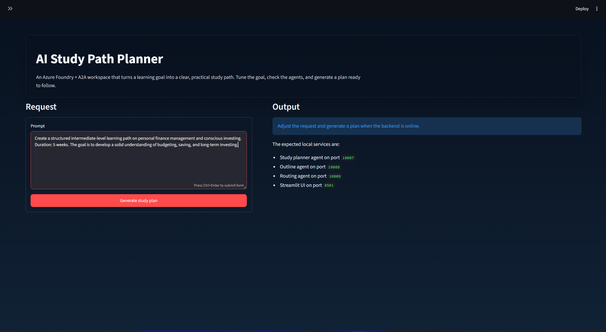
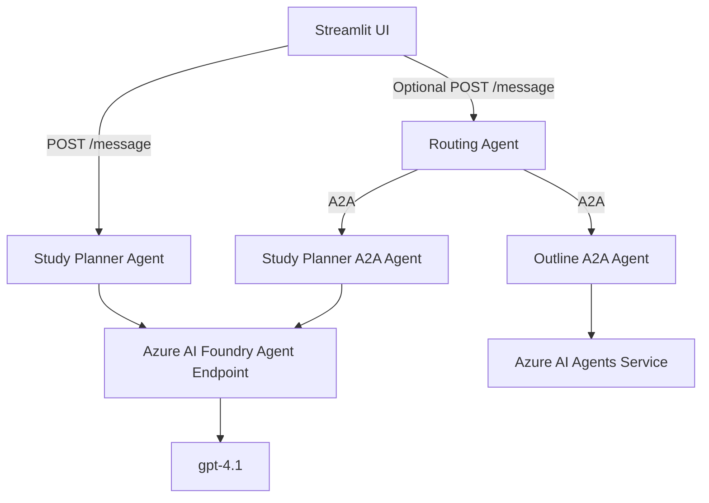

# AI Study Path Planner

An AI-powered study planning app built with **Azure AI Foundry**, **A2A agent communication**, **FastAPI/Starlette**, and **Streamlit**.

The app turns a learning goal into a structured study path with milestones, exercises, checkpoints, and a final mini project. It includes a Streamlit interface, a direct Study Planner endpoint, and a routing agent that can communicate with remote A2A agents.

## Demo

This repository includes the application code, architecture notes, setup instructions, UI previews, and real sample outputs. The Streamlit app itself runs as a Python service, so GitHub can show the project but cannot host the live interactive backend directly from the README.

UI preview:



Generated output preview:

**Prompt**

### Study plan generated

# Intermediate Personal Finance Management & Conscious Investing Study Plan

**Duration:** 5 Weeks

---

## Introduction

Personal finance management and conscious investing are essential skills for achieving financial stability and long-term wealth. Understanding how to budget effectively, save consistently, and make thoughtful investment decisions enables you to take control of your financial future.

In today’s world, financial literacy can directly impact your quality of life and opportunities. Learning these skills is an important step toward independence and smarter financial decisions.

---

## Week 1: Foundations of Personal Finance
**Goal:** Understand core concepts of managing personal finances and track your money.

### Topics Covered
- What is personal finance?
- Importance of financial literacy (National Endowment for Financial Education → https://www.nefe.org)
- Income vs expenses
- Creating and maintaining a simple budget

### Activities
- Read: Personal Finance Basics (Investopedia → https://www.investopedia.com)
- Watch: Budgeting 101 (Khan Academy → https://www.khanacademy.org)
- Exercise: Track all expenses for one week using a spreadsheet or budgeting app

---

## Week 2: Saving Strategies & Emergency Funds
**Goal:** Learn effective saving methods and understand the role of emergency funds.

### Topics Covered
- Short-term vs long-term financial goals
- Saving strategies (automatic transfers, percentage-based saving)
- Emergency funds (Consumer Financial Protection Bureau → https://www.consumerfinance.gov)
- Smart banking (interest rates, account types)

### Activities
- Read: Saving Money Strategies (NerdWallet → https://www.nerdwallet.com)
- Set up an automatic savings plan or increase savings rate
- Calculate your emergency fund target based on monthly expenses

---

## Week 3: Conscious Spending and Debt Management
**Goal:** Learn how to manage spending and handle debt responsibly.

### Topics Covered
- Needs vs wants analysis (Federal Trade Commission → https://www.ftc.gov)
- Reducing unnecessary expenses
- Types of debt (credit cards, loans, mortgages)
- Debt repayment strategies (snowball vs avalanche method)

### Activities
- Read: How to Manage Debt (MoneyHelper UK → https://www.moneyhelper.org.uk)
- Create a needs vs wants spending breakdown
- Apply a debt repayment strategy

---

## Week 4: Introduction to Conscious Investing
**Goal:** Understand basic investment instruments and responsible investing.

### Topics Covered
- Stocks, bonds, ETFs
- Risk tolerance and time horizon (SEC Investor Education → https://www.investor.gov)
- ESG investing (Morningstar → https://www.morningstar.com)
- How to start investing safely

### Activities
- Read: Investing 101 (Robinhood Learn → https://learn.robinhood.com)
- Research 2–3 ESG funds
- Assess your personal risk tolerance via questionnaires

---

## Week 5: Building a Long-Term Plan
**Goal:** Combine all concepts into a personal financial roadmap.

### Topics Covered
- Financial goal setting
- Diversified portfolio creation
- Budget, savings, and investment tracking
- Long-term planning and review

### Activities
- Read: How to Build a Long-Term Portfolio (Fidelity Investments → https://www.fidelity.com)
- Draft a personal financial plan
- Review with mentor or peer

---

## Final Notes

Stay consistent and review your progress weekly. Financial literacy is a long-term skill that builds over time.

This 5-week path will give you practical tools to manage money effectively and make more conscious investment decisions.

**Prompt**

## Features

- Generates structured study plans from a natural-language learning goal.
- Supports difficulty and duration customization from the UI.
- Adds weekly milestones, exercises, checkpoints, and self-assessment questions.
- Uses Azure AI Foundry with Azure Identity authentication.
- Exposes a direct `/message` endpoint for the Streamlit UI.
- Includes A2A-compatible title/study, outline, and routing agents.
- Provides health checks for each local backend service.

## Architecture



## Project Structure

```text
python/
|-- web_ui.py                  # Streamlit interface
|-- run_all.py                 # Starts the local backend services and UI
|-- client.py                  # CLI client for the routing agent
|-- title_agent/
|   |-- server.py              # Study Planner A2A server + direct /message endpoint
|   |-- agent_executor.py      # A2A task execution logic
|   |-- foundry_client.py      # Azure Foundry Responses API client
|   `-- agent.py               # Azure AI Agents implementation
|-- outline_agent/
|   |-- server.py              # Outline A2A server
|   |-- agent_executor.py      # Outline A2A execution logic
|   `-- agent.py               # Azure AI Agents implementation
|-- routing_agent/
|   |-- server.py              # FastAPI routing endpoint
|   `-- agent.py               # Routing agent and A2A client logic
|-- requirements.txt
`-- .env.example
```

## Setup

### Prerequisites

- Python 3.10+
- Azure subscription with Azure AI Foundry access
- Azure CLI authenticated with `az login`
- A deployed Azure AI Foundry agent/model

### Install

```powershell
cd Labfiles\09-build-remote-agents-with-a2a\python
python -m venv labenv
.\labenv\Scripts\Activate.ps1
pip install -r requirements.txt
```

Create a `.env` file from `.env.example` and update the Azure values:

```env
SERVER_URL=localhost
TITLE_AGENT_PORT=10007
OUTLINE_AGENT_PORT=10008
ROUTING_AGENT_PORT=10009

FOUNDRY_AGENT_ENDPOINT=https://your-resource.services.ai.azure.com/api/projects/your-project/agents/your-agent/endpoint/protocols/openai/responses
FOUNDRY_API_VERSION=v1
FOUNDRY_AGENT_MODEL=gpt-4.1
PROJECT_ENDPOINT=https://your-resource.services.ai.azure.com/api/projects/your-project
MODEL_DEPLOYMENT_NAME=gpt-4.1
```

## Run Locally

```powershell
cd Labfiles\09-build-remote-agents-with-a2a\python
.\labenv\Scripts\Activate.ps1
python run_all.py
```

Open the UI:

```text
http://localhost:8501
```

Expected local services:

- Study Planner agent: `http://localhost:10007`
- Outline agent: `http://localhost:10008`
- Routing agent: `http://localhost:10009`
- Streamlit UI: `http://localhost:8501`

## API Test

Health check:

```powershell
Invoke-WebRequest -UseBasicParsing http://localhost:10007/health
```

Generate a study plan:

```powershell
$body = @{
  message = "Create an intermediate study plan for Azure AI agents. Duration: 4 weeks."
} | ConvertTo-Json

Invoke-WebRequest `
  -UseBasicParsing `
  -Uri "http://localhost:10007/message" `
  -Method Post `
  -Body $body `
  -ContentType "application/json"
```

## Security Notes

- `.env` is intentionally ignored by Git.
- Azure credentials are not stored in the repository.
- The app uses Azure Identity and your authenticated Azure CLI/session.
- For a public hosted demo, use managed identity or secret storage instead of local `az login`.

## Deployment

The current version is designed to run locally with Azure credentials and local backend services. For a public demo, the main decision is where to run the Python services and how to handle Azure authentication securely.

### Static GitHub Showcase

The repository includes UI previews under `docs/images/` and sample generations in [docs/demo-output.md](docs/demo-output.md). This is the simplest way to show the project on GitHub and LinkedIn without exposing Azure credentials or maintaining a public server.

This option is not interactive, but it clearly shows the interface, the architecture, and the kind of output the agent produces.

### Streamlit Community Cloud

Streamlit Community Cloud can host the UI, but the Azure settings must be moved to Streamlit Secrets and the backend endpoints need to be reachable from the public app. For this project, that likely means either deploying the API services separately or simplifying the demo into a single hosted Streamlit application.

### Azure App Service or Azure Container Apps

For a more complete deployment, the Streamlit UI and backend services can be packaged and hosted on Azure. Managed Identity is the preferred approach for connecting to Azure AI Foundry without hardcoded keys. This would provide a public URL that can be linked from GitHub or LinkedIn.

## Example Use Cases

- Generate a 4-week plan for learning Azure AI agents.
- Create an intermediate machine learning study roadmap.
- Produce milestones, exercises, checkpoints, and project ideas for a technical topic.

## Built With

- Python
- Streamlit
- FastAPI / Starlette
- Azure AI Foundry
- Azure Identity
- A2A protocol

## Project Note

Built by **Renzo Albertini** as a personal learning and portfolio project. AI assistance was used.
