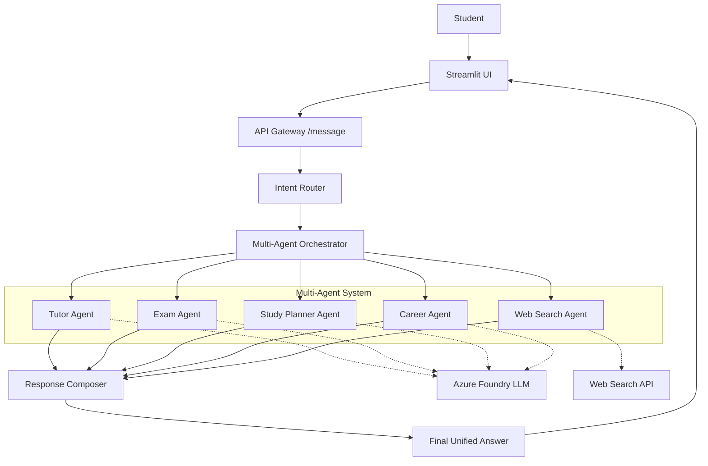

# AI Personal University Assistant


A unified AI assistant for students, built with Python, Streamlit, Azure AI Foundry, and A2A-compatible agent services.

The app exposes one main chat interface. Users can ask naturally for explanations, exam practice, study planning, web research with sources, or career guidance. The UI detects all relevant intents, executes them in sequence, and merges the result into one structured response.

## 📄 Demo Outputs

👉 [Open demo-output.md](./docs/demo-output.md)


## Features

- Unified chat-first Streamlit UI.
- Multi-intent routing for combined requests.
- Structured response sections:
  - Explanation
  - Exam Question
  - Study Plan
- Exam simulator with one-question-at-a-time flow and answer evaluation.
- Study planner with weekly milestones, practice work, and checkpoints.
- Career advisor for skills, portfolio projects, CV/interview preparation.
- Azure Foundry Responses API integration.
- Azure Foundry web search tool integration with source citations.
- A2A-compatible local agent services:
  - University Assistant agent
  - Outline agent
  - Routing agent
- Lightweight local memory for weak topics and exam progress.

## Architecture

The project follows a clean multi-agent assistant architecture. The user only sees one chat, while the backend detects the intent, runs the right capabilities, and merges everything into one final answer.



### Component Responsibilities

| Layer | Responsibility |
| --- | --- |
| Streamlit UI | Provides one chat interface for every student request. |
| Backend API | Keeps one entry point for the assistant and preserves A2A compatibility. |
| Intent Router | Detects one or more intents from the same user message. |
| Agent and Tool Layer | Runs the selected capability: tutoring, exam, planning, career advice, or web search. |
| Response Composer | Merges all partial outputs into one structured answer. |
| Azure AI Foundry | Provides model responses and optional web-search grounding. |

### Runtime Flow

```text
Student message
  -> Streamlit UI
  -> Backend API (/message)
  -> Intent Router
  -> Selected agents/tools
  -> Response Composer
  -> Final unified answer
  -> Streamlit UI
```

The response composer is the key coordination layer: multi-intent requests do not become separate disconnected answers. They are executed in sequence and returned as one readable response.

## Project Structure

```text
python/
|-- main.py                    # Primary local entry point
|-- run_all.py                 # Backward-compatible runner
|-- requirements.txt
|-- README.md
|-- agents/
|   |-- title_agent/           # University Assistant A2A + direct endpoint
|   |-- outline_agent/         # Outline A2A agent
|   `-- routing_agent/         # Foundry routing agent + A2A client
|-- core/
|   |-- router.py              # Multi-intent routing logic
|   |-- response_composer.py   # Merges agent/tool results into one answer
|   |-- prompts.py             # Prompt builders
|   `-- memory.py              # Lightweight local JSON memory
|-- tools/
|   |-- web_search.py          # Azure Foundry web search integration
|   `-- client.py              # Optional CLI client
|-- ui/
|   `-- app.py                 # Unified Streamlit chat UI
|-- config/
|   |-- settings.py            # Shared paths and env helpers
|   `-- .env.example           # Example local configuration
`-- docs/
    `-- immages/               # UI screenshots used by the README
```

## Prerequisites

- Python 3.10+
- Azure subscription with Azure AI Foundry access
- Azure CLI authenticated with `az login`
- Azure Foundry project and model deployment
- Azure Foundry web search support enabled for the model/project if you want live web search

## Setup

From this folder:

```powershell
python -m venv labenv
.\labenv\Scripts\Activate.ps1
pip install -r requirements.txt
```

Create your local `.env` from the example:

```powershell
Copy-Item config\.env.example .env
```

Update `.env` with your Azure Foundry values:

```env
SERVER_URL=localhost
TITLE_AGENT_PORT=10007
OUTLINE_AGENT_PORT=10008
ROUTING_AGENT_PORT=10009

PROJECT_ENDPOINT=https://your-resource.services.ai.azure.com/api/projects/your-project
MODEL_DEPLOYMENT_NAME=gpt-4.1
FOUNDRY_AGENT_ENDPOINT=https://your-resource.services.ai.azure.com/api/projects/your-project/openai/v1/responses
FOUNDRY_API_VERSION=v1
FOUNDRY_AGENT_MODEL=gpt-4.1
```

Do not commit `.env`. It is ignored by `.gitignore`.

## Run

```powershell
python main.py
```

Then open:

```text
http://localhost:8501
```

The runner starts:

- University Assistant: `http://localhost:10007`
- Outline Agent: `http://localhost:10008`
- Routing Agent: `http://localhost:10009`
- Streamlit UI: `http://localhost:8501`

`python run_all.py` still works as a compatibility wrapper.

## Example Prompts

```text
Explain Azure AI agents, ask me an exam question, and make a study plan.
```

```text
Create a 6-week beginner study plan for machine learning.
```

```text
Simulate an exam on Azure AI Foundry agents.
```

```text
Search online for the latest Azure AI Foundry agent documentation with 3 sources.
```

```text
Give me career advice for becoming an AI engineer and suggest portfolio projects.
```

## Multi-Intent Behavior

If a request contains multiple tasks, the assistant does not return separate independent mode blocks. It detects all intents, runs them in sequence, and merges the result into one response using these sections:

```text
Explanation
Exam Question
Study Plan
```

Career and web-search outputs are merged into the Explanation section so the final answer stays readable.

## Sample Outputs

The exact response changes depending on the deployed model, but these examples show the kind of structured output the assistant produces.

### Example 1: Explain + Exam + Study Plan

**Prompt**

```text
Explain overfitting, give me an exam question, and tell me how to study it in 3 days.
```

**Detected intents**

```text
Explanation + Exam Question + Study Plan
```

**Output preview**

```text
### Explanation

Overfitting happens when a model learns the training data too closely, including
noise and outliers, instead of learning the general pattern. The model may perform
very well on training data but poorly on new data.

### Exam Question

Define overfitting in machine learning. Give one real-world scenario where it can
happen and explain one method to prevent it.

### Study Plan

Day 1: Understand the concept
- Write the definition in your own words.
- Compare overfitting and underfitting with a simple diagram.
- Checkpoint: explain why high training accuracy can still be misleading.

Day 2: Identify and prevent overfitting
- Study validation sets, cross-validation, regularization, and early stopping.
- Practice reading train/test performance curves.

Day 3: Apply it
- Train a simple model, intentionally overfit it, then reduce overfitting.
- Final checkpoint: explain what changed and why.
```

### Example 2: Career Goal + Test Question + Roadmap

**Prompt**

```text
I want to become an AI Engineer. Explain what I should study, test me with a question, and give me a roadmap.
```

**Detected intents**

```text
Explanation + Exam Question + Study Plan
```

**Output preview**

```text
### Explanation

To become an AI Engineer, focus on Python, data handling, machine learning,
model evaluation, neural networks, cloud deployment, and version control.
Strong foundations in probability, linear algebra, and practical model-building
are especially important.

### Exam Question

Explain the difference between supervised and unsupervised learning. Provide one
example use case for each.

### Study Plan

Week 1: Python and data fundamentals
Week 2: Machine learning basics and evaluation metrics
Week 3: Neural networks and deep learning frameworks
Week 4: Deployment, GitHub portfolio, and a small end-to-end AI project

Portfolio ideas:
- Image classifier deployed with Streamlit
- Resume/CV analyzer with Azure AI
- Retrieval-based study assistant with citations
```

### Example 3: Strict Oral Exam

**Prompt**

```text
Start a difficult oral exam on neural networks and correct me strictly.
```

**Output preview**

```text
### Exam Question

Question 1/5

Explain the role of activation functions in a feedforward neural network.
What would happen if hidden layers used no activation function?

Reply directly in the chat and the assistant will evaluate your answer with a
score, feedback, weak topics, and a model answer.
```

## Local State

The app stores lightweight memory under:

```text
.data/student_memory.json
```

This file is generated automatically and ignored by Git.

## GitHub Notes

- `.env`, logs, local memory, virtual environments, and cache folders are ignored.
- Keep `config/.env.example` updated when adding new configuration values.
- Use `main.py` as the primary entry point.
